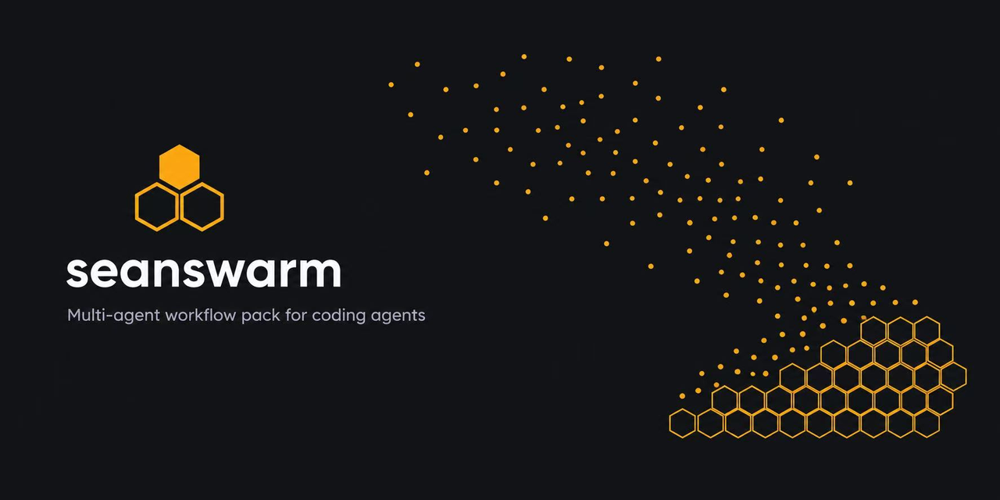
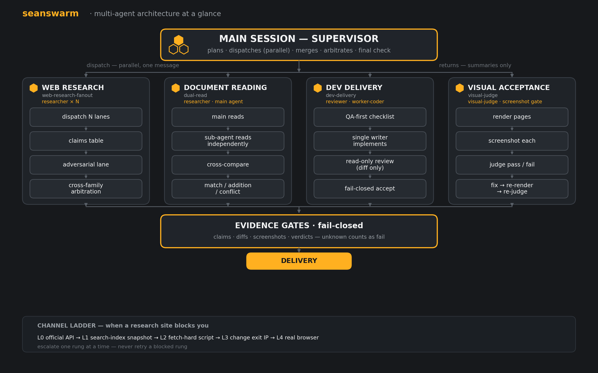

# seanswarm



**面向主流编码 agent 的轻量多智能体工作流技能包——Claude Code、Codex、Cursor、ZCode 等兼容宿主。**
把编码 agent 变成一支受管的小团队：带证据治理的全网调研、双通道文档精读、带独立审查与视觉验收的开发交付。

[English](README.md)

---

## 这是什么

一组**技能（skills）+ 角色模板（agents）**，安装进市面主流编码 agent（Claude Code、Codex、Cursor、ZCode 等）。没有运行时、没有服务、不是框架——宿主自己执行这些协议，技能只描述"怎么组织工作"。

覆盖四个场景：

| 场景 | 组成 | 打法 |
|---|---|---|
| 全网调研 | `skills/web-research-fanout` | 扇出 lane → claims 表 → 对抗 lane → 跨家族仲裁 → 反爬阶梯（L0–L4） |
| 文档精读 | `skills/dual-read` | 两条独立通道读同一份文档 → 交叉比对（一致 / 增量 / 矛盾） |
| 开发交付 | `skills/dev-delivery` | QA-first 验收清单 → 单写手 → 独立只读审查（只喂 diff）→ fail-closed 验收 → 修复回唯一写手 |
| 视觉验收 | `agents/visual-judge.md` + `hooks/ui-screenshot-gate.mjs` | 渲染 → 截图 → 逐页判卷 → 修复 → 重渲染；机械 hook 拦住"没截图就说完成" |

角色模板在 `agents/`：researcher / reviewer / worker-coder / visual-judge。

## 架构



## 设计原则

- **证据优先于共识**：结论必须带来源；冲突靠仲裁解决，禁止多数票。独立来源数 > 投票数；一手 > 二手；新 > 旧。
- **角色分离，不要全能神**：审查者零写权限、写手唯一、对抗 lane 专职找反证。
- **干净上下文审查**：审查者只拿 diff + 需求，不喂会话历史。
- **fail-closed 验收**：unknown 即未通过；空 diff 需显式豁免。
- **finder ≠ fixer**：审查者只找不修，修复回唯一写手，单轮不递归。
- **verification-before-completion**：没有新鲜运行输出，不许说"完成"。
- **机械闸门 > 聪明提示词**：hook 的存在是因为光靠提示词管不住。

## 安装

```bash
# 技能 → 你的 skills 目录
cp -r skills/* <skills-dir>/
# 角色 → 你的 agents 目录
cp agents/*.md <agents-dir>/
```

常见位置：ZCode `~/.agents/skills` + `~/.zcode/agents`；Claude Code `~/.claude/skills` + `~/.claude/agents`；Codex `~/.codex/skills`。各平台细节见 `adapters/`。

ZCode 还可用插件形态：仓库自带 `.zcode-plugin/plugin.json`，把仓库加为插件源启用即可。

可选 hook：`hooks/ui-screenshot-gate.mjs`（Stop 事件闸门——改了 UI 文件但整轮没截图证据会把你弹回补证据），接线说明见 `hooks/README.md`。

## 怎么用

- 调研：*"全网查一下 X，多源核对了再给我结论。"*
- 精读：*"这份合同用双通道精读一遍，交叉比对。"*
- 开发：*"实现 Y：QA-first、单写手、独立审查，unknown 算不过。"*
- 视觉验收：*"把这份 PPT 渲染成 PNG，逐页判卷，不过的修完重判。"*

## 设计说明

**编排层 vs 通道层**：本包把"怎么组织"（lane/档位/契约/仲裁）和"怎么把数据拿到手"（API/索引层/直抓/浏览器）分开。很多被归咎于"模型不行"的失败，其实是通道失败。

**扇出不是克隆**：N 个 agent 问同一个问题，会捡到同一批页面、强化同一个错误。lane 必须在源类、语言、立场、模型家族里至少占一个独立维度。

**输出形态**：每条 lane 必须交的 claims 表长什么样，见 `examples/claims-table-sample.md`。

**成本（4 lane 实跑，属标准档低配；标准档为 5–8 lane，单一环境）**：约 56 万 token，墙钟 ≈5 分钟（并行）+ 仲裁 ≈1 分钟。重型档（10–20 lane）约 150万–400万 token/轮。详见 `FIELD-NOTES.md`。

## 与同类项目的关系

生态很活跃，本包不宣称任何"首创"——价值在组合与实战打法。

| 项目 | 是什么 | 本包的差异 |
|---|---|---|
| [Socialpranker/deepdive](https://github.com/Socialpranker/deepdive) | 研究流水线：并行子代理 + claims 账本 + 5 角色 red team + 反爬阶梯 | 研究侧最近的邻居；本包多了跨家族仲裁 + 双通道精读，形态是轻量技能包而非脚本流水线 |
| [obra/superpowers](https://github.com/obra/superpowers) | 开发方法论与技能框架 | 开发侧同方向；本包多了视觉闸门 + 机械截图 hook，且体量小得多 |
| [Weizhena/Deep-Research-skills](https://github.com/Weizhena/Deep-Research-skills) | 结构化深度研究技能（人机协同、多平台） | 本包的研究技能多了对抗 lane、仲裁与反爬阶梯 |
| [mvanhorn/last30days-skill](https://github.com/mvanhorn/last30days-skill) | 社媒调研技能（单 agent 架构） | 架构不同；其社媒通道工程值得参考 |
| [zhjai/agent-arena](https://github.com/zhjai/agent-arena) | 跨模型辩论/评审协议 | 同一种"异构模型"思路用在代码评审；本包把它用在调研冲突上并明确禁止多数票 |
| [eforge-build/eforge](https://github.com/eforge-build/eforge) | 规格到已验证代码的构建系统 | 本包借鉴其 fail-closed 验收规则，做成可移植技能 |
| [lucasfcosta/backpressured](https://github.com/lucasfcosta/backpressured) | 无人值守长编码会话技能（含 Playwright 视觉评审） | 视觉闸门思路相近；本包多了机械（非 LLM）截图 hook |

借鉴致谢：diff-only 审查输入（superpowers）、fail-closed 验收（eforge）、熔断 + 留痕 + 防静默换模型（ai-cross）、计划门 + 少数派律师角色（deepdive）、对抗行为测试（last30days）。

## 状态与路线

v0.1.0。技能以英文为主版（`SKILL.md`），附中文对照（`SKILL.zh.md`）；角色模板正文英文、描述双语。Codex/Cursor 适配器为草稿待实测。

- v0.2：可机跑的评测（含对抗 lane 行为测试）；派发留痕工具；跨轮 claims 对账。

## 许可

MIT，见 `LICENSE`。
